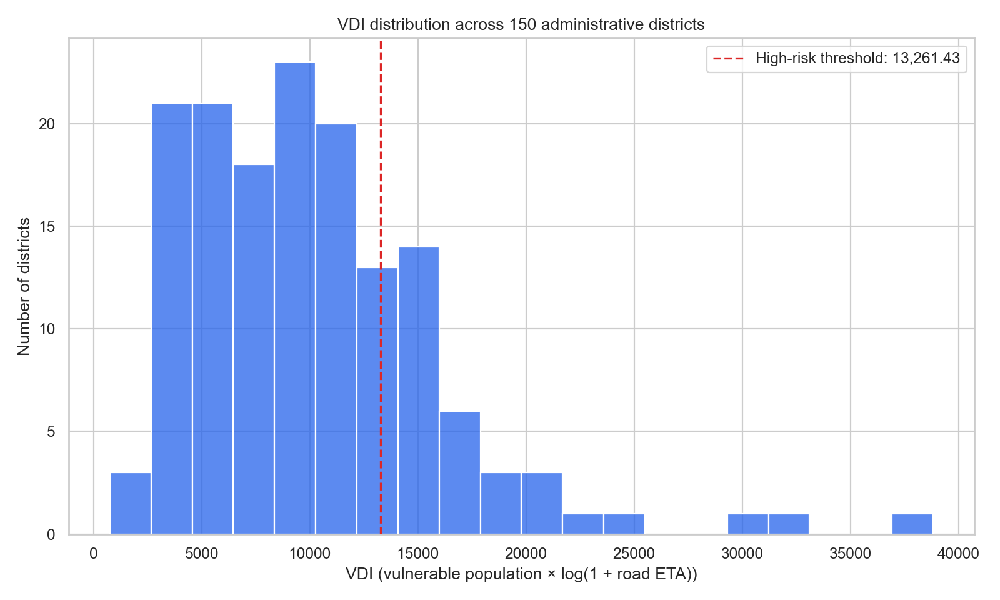
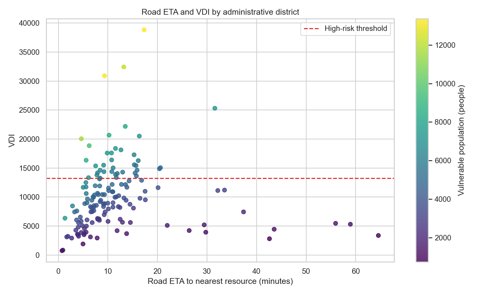

# Golden Data Lab

대구 골든타임의 검증된 정책분석 스냅샷을 바탕으로 SQL, Python EDA, 시각화와 의사결정 보고를 확장하는 데이터 분석 저장소입니다.

이 저장소는 시민용 웹서비스를 운영하는 [`ssg-sak/golden-project`](https://github.com/ssg-sak/golden-project)와 책임을 분리합니다. 웹서비스의 실시간·준실시간 응급의료 조회 기능은 포함하지 않으며, 특정 시점에 검증된 정책 데이터의 탐색·재현·해석에 집중합니다.

## 현재 제공 범위

- 검증 스냅샷 다운로드와 SHA-256 확인
- 150개 행정동, 25개 응급 관련 기관, 9개 후보지, 5,100개 도로 경로 데이터 계약 확인
- 취약인구·도로 이동시간·VDI 분포 탐색
- 결측·중복·음수·취약인구 합계 관계를 검사하는 재현 가능한 EDA 스크립트
- 정책 후보와 접근성 결과의 분석용 해석
- 재현 가능한 Jupyter Notebook

SQL 분석과 Power BI 대시보드는 계획 단계입니다. 구현되지 않은 결과를 완료 기능으로 표시하지 않습니다.

## 데이터 기준

| 항목 | 값 |
|---|---:|
| 정책 릴리스 | `2026-07-18-r2` |
| 인구 기준월 | `2026.06` |
| 행정동 | 150개 |
| 응급 관련 기관 | 25개 |
| 정책 후보지 | 9개 |
| 검증 도로 경로 | 5,100개 |

위 데이터는 실시간 데이터가 아닌 검증 스냅샷입니다. VDI와 후보지 결과는 정책 검토용 비교 모델이며 실제 시설 입지, 진료 가능 여부 또는 구급차 이송 성과를 보증하지 않습니다.

## 시작하기

Python 3.11 이상을 권장합니다.

```bash
python -m venv .venv
python -m pip install -r requirements.txt
python python/fetch_policy_release.py
python python/run_eda.py
jupyter notebook notebooks/01_daegu_data_eda.ipynb
```

다운로드 스크립트는 `golden-project`의 고정 커밋에서 정책 릴리스를 가져온 뒤 원시 파일 SHA-256을 검증합니다. 검증에 실패하면 분석 파일로 저장하지 않습니다.

EDA 스크립트는 내부 콘텐츠 해시와 데이터 계약을 다시 검사한 후 `outputs/`에 분석용 CSV, 요약 JSON과 그래프를 생성합니다. `outputs/`는 재생성 가능한 로컬 산출물이므로 Git에 커밋하지 않습니다. 주요 해석은 [`docs/EDA_REPORT.md`](./docs/EDA_REPORT.md)에 기록합니다.

## 주요 분석 결과

전체 재생성 산출물은 `outputs/`에 두고, 저장소 방문자가 바로 확인할 대표 그래프만 `docs/assets/`에 검토본으로 보존합니다.





## 저장소 구조

```text
golden-data-lab/
├── datasets/                      # 내려받은 검증 스냅샷과 데이터 안내
├── notebooks/                     # Python EDA 노트북
├── python/                        # 수집·검증 보조 스크립트
├── 01_sql_public_health_analysis/ # SQL 학습·분석 작업 영역
├── powerbi/                       # Power BI 작업 영역
├── docs/                          # 출처·방법·한계 문서와 대표 시각화
├── ROADMAP.md
└── requirements.txt
```

## 원칙

- 원천과 기준 시점을 기록합니다.
- 미확인 정보와 실제 부재를 구분합니다.
- 분석 결과를 의료적 판단이나 최종 정책 결정으로 표현하지 않습니다.
- 재생성 가능한 산출물과 사람이 검토한 공개 결과를 구분합니다.
- AI 도구를 사용한 경우 초안·보조와 본인 검증 책임을 구분합니다.

## 관련 프로젝트

- 서비스·정책 엔진: [대구 골든타임](https://github.com/ssg-sak/golden-project)
- 공개 서비스: [https://ssg-sak.github.io/golden-project/](https://ssg-sak.github.io/golden-project/)
