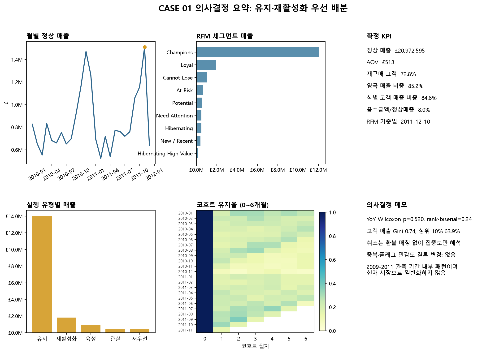
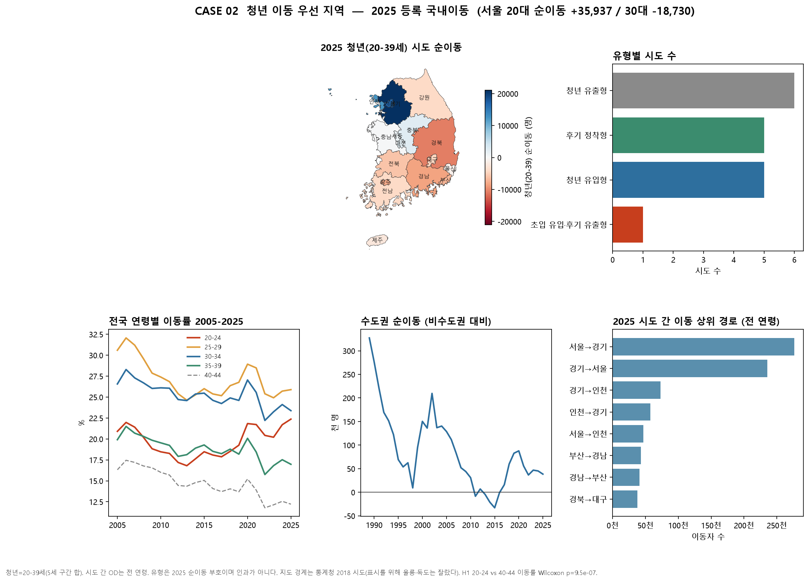

# Golden Data Lab

[](https://github.com/ssg-sak/golden-data-lab/actions/workflows/analysis-tests.yml)

**SQL → 데이터 품질 → Python EDA → 통계 → KPI → 시각화 → 실행 제안 → 재현성**을 하나의 흐름으로 반복 검증하는 데이터 분석 포트폴리오입니다.

서로 다른 도메인의 원천 데이터를 같은 분석 원칙으로 다루면서, 단순 노트북 결과가 아니라 **분석 질문·지표 정의·품질 기준·통계적 근거·의사결정용 결과물·재현 절차**까지 남기는 것을 목표로 합니다.

## Results at a Glance

| Case | 데이터 | 분석 초점 | 완료 상태 |
| --- | --- | --- | --- |
| **CASE 01 · Retail Customer & Revenue** | UCI Online Retail II · 약 **106만 거래 라인** | 취소·반품, 매출, RFM, 코호트, 재구매 | **9/9 단계 완료** |
| **CASE 02 · Youth Migration & Regional Dynamics** | 국가데이터처 국내인구이동통계 | 20–39세 순이동, 20대/30대 방향 차이, 지역 유형 | **9/9 단계 완료** |

<p align="center">
  
  
</p>

| 바로 보기 | 링크 |
| --- | --- |
| 공개 웹 대시보드 | [GitHub Pages](https://ssg-sak.github.io/golden-data-lab/dashboard/) |
| CASE 01 분석 | [Retail Customer & Revenue Analytics](./cases/01_retail_customer_analytics/README.md) |
| CASE 02 분석 | [Youth Migration & Regional Dynamics](./cases/02_youth_migration_dynamics/README.md) |
| 표준 분석 절차 | [9단계 Methodology](./docs/methodology.md) |
| 자동 검증 | [GitHub Actions · analysis-tests](https://github.com/ssg-sak/golden-data-lab/actions/workflows/analysis-tests.yml) |

## What This Repository Demonstrates

- **SQL과 Python의 역할 분리:** 추출·집계와 분석·검증을 목적에 맞게 나눕니다.
- **데이터 품질 우선:** 결측·중복·이상치와 지표의 분모·기간·제외 조건을 먼저 고정합니다.
- **통계와 해석의 경계 관리:** 효과 크기·불확실성을 확인하고 데이터에 없는 인과를 단정하지 않습니다.
- **의사결정 연결:** 결과를 한 페이지 대시보드와 실행 가능한 제안으로 연결합니다.
- **재현 가능성:** SQL, 코드, 테스트, 데이터 출처, 실행 순서와 분석 한계를 함께 기록합니다.

## Standard Methodology

모든 사례는 [9단계 표준 분석 방법론](./docs/methodology.md)을 따릅니다.

| 단계 | 이름 | 핵심 작업 |
| --- | --- | --- |
| 1 | Business Question | 해결할 비즈니스·정책 질문과 의사결정 정의 |
| 2 | SQL Extraction | PostgreSQL 원천 적재, SQL 추출 및 기본 집계 |
| 3 | Data Quality Check | 결측치, 중복, 이상치와 정제 기준 확립 |
| 4 | Python EDA | 분포, 추세, 관계와 세그먼트 탐색 |
| 5 | Statistical Analysis | 가설 검정, 효과 크기와 불확실성 확인 |
| 6 | KPI & Segmentation | 핵심 지표와 고객·지역 분류 기준 정의 |
| 7 | Visualization | matplotlib 한 페이지 PNG 의사결정 대시보드 |
| 8 | Insight & Action | 검증된 사실을 실행 가능한 제안으로 변환 |
| 9 | Reproduction | 환경, 데이터 출처와 실행 순서 문서화 |

## Cases

### CASE 01: Retail Customer & Revenue Analytics

UCI Online Retail II의 약 106만 건 거래 라인을 이용해 고객과 매출 구조를 분석합니다.

- 기간: 2009-12-01 ~ 2011-12-09
- 핵심 주제: 데이터 품질, 취소·반품, 매출 지표, RFM, 코호트, 재구매
- 현재 상태: 9단계 완료 (적재·품질·EDA·통계·KPI·대시보드·인사이트·재현)
- [CASE 01 문서](./cases/01_retail_customer_analytics/README.md)
- [인사이트와 실행 제안](./cases/01_retail_customer_analytics/INSIGHTS.md)
- [재현 절차](./cases/01_retail_customer_analytics/REPRODUCTION.md)
- [분석 용어 학습 가이드](./cases/01_retail_customer_analytics/STUDY_GUIDE.md)

이 데이터는 역사적 데이터이므로 현재 소매시장을 설명하는 근거로 사용하지 않습니다. CASE 01은 대규모 거래 데이터의 처리와 분석 방법론을 증명하는 사례입니다.

### CASE 02: Youth Migration & Regional Dynamics

국가데이터처 2025 국내인구이동통계 부표로 청년(20-39세) 시도 순이동과 전 연령 시도 간 흐름을 분석합니다.

- 기간: 연령·시도 추세 2005-2025, 시도×연령 순이동과 OD는 2025
- 핵심 주제: 청년 정의, 등록 이동, 수도권, 20대/30대 부호, 지역 유형
- 현재 상태: 9단계 완료 (적재·품질·EDA·통계·KPI·시도 지도·대시보드·인사이트·재현)
- [CASE 02 문서](./cases/02_youth_migration_dynamics/README.md)
- [인사이트와 실행 제안](./cases/02_youth_migration_dynamics/INSIGHTS.md)
- [재현 절차](./cases/02_youth_migration_dynamics/REPRODUCTION.md)
- [분석 용어 학습 가이드](./cases/02_youth_migration_dynamics/STUDY_GUIDE.md)

청년 OD(전출지×전입지×연령)는 이 부표에 없습니다. 등록 이동을 주거 의향이나 정책 효과로 단정하지 않습니다.

## Repository Structure

```text
golden-data-lab/
├── .github/workflows/
│   └── analysis-tests.yml
├── cases/
│   ├── 01_retail_customer_analytics/
│   │   ├── data/
│   │   ├── notebooks/
│   │   ├── src/
│   │   ├── sql/
│   │   ├── tests/
│   │   ├── evidence/
│   │   ├── README.md
│   │   ├── INSIGHTS.md
│   │   ├── REPRODUCTION.md
│   │   └── STUDY_GUIDE.md
│   └── 02_youth_migration_dynamics/
│       ├── data/
│       ├── notebooks/
│       ├── src/
│       ├── sql/
│       ├── tests/
│       └── evidence/
├── common/
├── docs/
│   ├── dashboard/
│   ├── methodology.md
│   └── case_template.md
├── LICENSE
├── .gitignore
└── requirements.txt
```

원본 및 정제 데이터 파일은 용량과 출처 관리 문제로 Git에 커밋하지 않습니다. 각 사례의 `data/raw`와 `data/processed`에는 디렉터리 구조만 보존합니다.

## Verification

`main` 브랜치의 push와 pull request마다 두 사례의 단위 테스트를 GitHub Actions에서 실행합니다. 원본 공공데이터 파일이 필요한 검증은 파일이 없을 때 명시적으로 skip되며, 순수 로직 테스트는 저장소만으로 실행됩니다.

```bash
python -m unittest discover -s cases/01_retail_customer_analytics/tests -v
python -m unittest discover -s cases/02_youth_migration_dynamics/tests -v
```

## Tech Stack

- Database: PostgreSQL, DBeaver
- Analysis: Python, pandas, GeoPandas, JupyterLab, scipy
- Statistics and Visualization: matplotlib, seaborn, scipy.stats
- Public dashboard: static HTML (`docs/dashboard`)
- Reproducibility: Git, GitHub Actions, documented SQL, tests and notebooks

## Quick Start

```bash
python -m venv .venv
```

Windows PowerShell:

```powershell
.\.venv\Scripts\Activate.ps1
pip install -r requirements.txt
python -m unittest discover -s cases/01_retail_customer_analytics/tests -v
python -m unittest discover -s cases/02_youth_migration_dynamics/tests -v
```

원본 데이터까지 포함해 전체 분석을 재현하려면 각 CASE의 `REPRODUCTION.md`를 따릅니다. CASE 01 원본 데이터는 제공된 다운로드 스크립트로 받을 수 있습니다.

## Working Principles

- 원본 데이터는 수정하지 않습니다.
- 지표마다 분모, 기간, 단위와 제외 조건을 기록합니다.
- 데이터에 없는 사실이나 인과관계를 추정해 단정하지 않습니다.
- 오래된 데이터의 결과를 현재 시장으로 일반화하지 않습니다.
- 결과뿐 아니라 실패한 가정, 분석 한계와 재현 절차도 남깁니다.

## License

Code in this repository is available under the [MIT License](./LICENSE). Data and third-party materials remain subject to their original terms and licenses.
